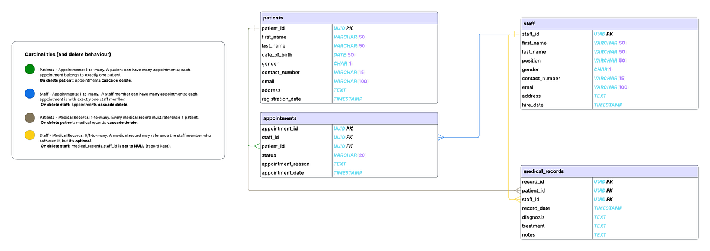

# spring-data-jpa-search

This project is a demo of Spring Data JPA Search options for [this](https://euedofia.medium.com/d4a5b5973e00?source=friends_link&sk=8bd6a6b838e7c3c2a173ad0aa4604cc9) blog post

## Database structure
This project is based on the below Entity Relationship Diagram


## Running 

### Pre-requisites
- Java 21
- Docker
- Run docker-compose to setup DB and test data from this [GitHub repo](https://github.com/Gogetter/postgres-docker-compose)

### Running the application

- Clone the [GitHuB repo](https://github.com/Gogetter/spring-data-jpa-search)
- Navigate to the project directory
- Run 
    ```bash
    ## for Mac/Linux
    ./gradlew bootRun
    
    ## for Windows
    .\gradlew.bat bootRun
    ```

## Blog post available [here]()
